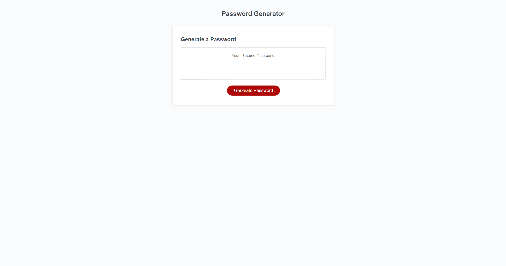

# UTA Module 3 Password Generator

## Description

I made this for a challenge for the UTA Fullstack Development bootcamp. It's a logic challenge to take user input and
generate a password based on their specifications. It can generate a password that includes Lower case and Upper case letters, numbers, and special characters, and the password can be 8 to 128 characters long.
 
It helped me get back into the grove of separating things that will happen multiple times into functions, and to get used to the logic around how to manage
various combinations of user input.

## Usage

Link to the webpage: https://devonmcfarlen.github.io/UTA-Bootcamp-module3-challenge-PasswordGenerator/

## License

MIT License